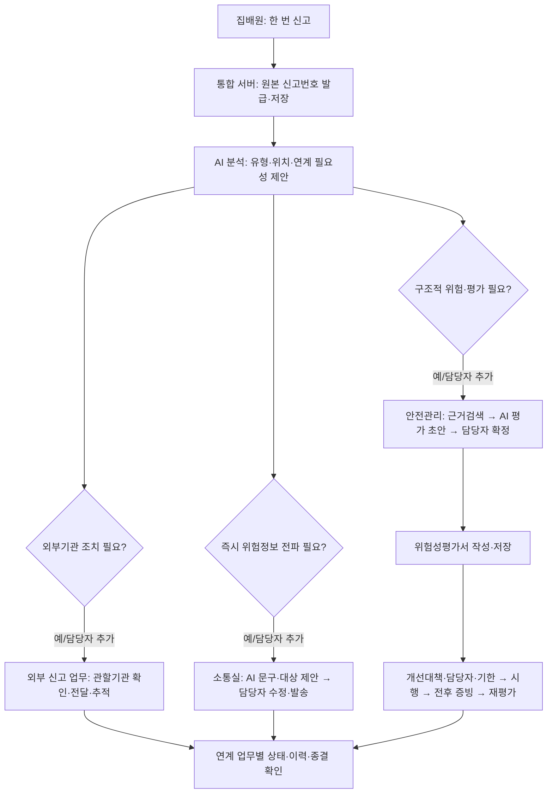
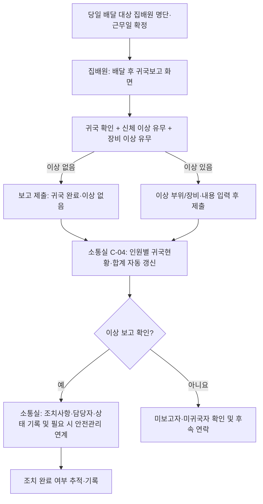
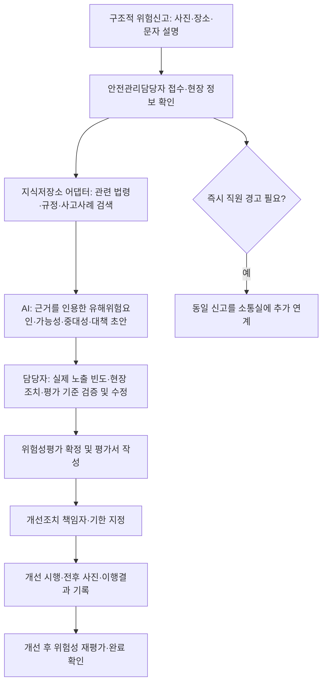
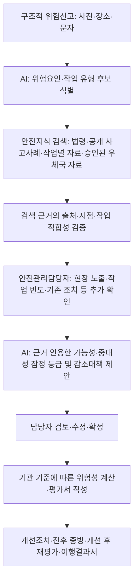

# AGENTS.md — 안심ON 통합 신고·안전관제·위험성평가 개발 지침

> 상태: **목표 설계 및 개발 지침**. 본 문서는 기존 코드의 구현 완료를 뜻하지 않는다. 개발 에이전트는 먼저 실제 저장소를 조사하고 구현됨/부분 구현/미구현을 표시한 후 작업한다.
>
> 목적: 공모전 출품 → 장흥우체국 소규모 시범운영 → 승인·보안 검토를 거친 실제 우체국 도입. 기존 기능을 보존하며 단계적으로 확장한다.

## 0. 개발 에이전트의 최우선 규칙

1. **집배원은 같은 사건을 한 번만 신고한다.** 신고 원본은 한 건이며, 외부기관 조치·소통실 전파·안전관리 위험성평가는 별도의 연결 업무로 생성한다.
2. **즉각적 내부위험신고는 버튼 → 음성 녹음 → 전송으로 끝낸다.** 집배원에게 알림 문구 작성, 전파 대상 선정, 위험도 평가를 요구하지 않는다. 위치는 가능한 경우 자동 첨부하며, 위치 확보 실패 시 신고 자체를 막지 않는다.
3. **구조적 내부위험신고는 사진·장소·문자 설명으로 접수한다. 음성 입력을 요구하거나 기본 화면에 넣지 않는다.** 시간적 여유가 있는 신고로 설계한다.
4. AI는 신고 분류, 연계 필요성, 전파 문구·대상, 위험성평가의 **근거 있는 초안**만 제안한다. 담당자의 확인·수정·확정 및 발송을 대체하지 않는다.
5. 외부 신고·내부 즉각 위험·내부 구조적 위험은 **서로 배타적인 분류가 아니다**. 동일 사건이 여러 업무로 동시에 연계될 수 있다.
6. **소통실 공지 메뉴는 단일 `공지사항`으로 통일한다.** 소통실 전달사항, 물류과장 말씀 등 작성 주체별 카테고리를 만들지 않는다. 작성자·발송자·대상은 이력에 남긴다.
7. 위험성평가용 **안전지식 저장소**에는 산업재해 고위험요인(SIF) 아카이브 등 공개 사고사례, 산업안전 관련 법령·규정, 사다리·시설보수 등 작업별 안전자료, 승인된 우체국 고유 자료, 기관의 평가 기준표를 구분해 수용한다. **현재는 외부 저장소(Supabase 등) 연동 인터페이스만 우선 확보**하고 실제 연결·자료 적재는 별도 단계로 진행한다. 미연결 자료를 연결된 것처럼 표시하거나 근거를 꾸며내지 않는다.
8. 외부 지자체 자동 전송, 모바일 푸시, 기관 업무시스템 연동은 공식 연계·권한·보안 검토 전에는 **시범용/전달 대기** 상태를 실제 완료로 표시하지 않는다.
9. 민감한 복지위기 정보는 일반 소통실·안전관리 화면으로 무차별 전파하지 않는다. 역할별 최소 접근 원칙을 적용한다.
10. 모든 중요한 업무에는 원본, AI 제안, 담당자 수정, 승인·발송, 처리 결과와 시각을 남긴다.
11. **귀국보고는 위험신고와 별도인 일일 근무 종료 확인 업무**다. 집배원은 배달 후 귀국 여부와 신체·장비 이상 유무를 간단히 보고하고, 소통실은 당일 대상 인원 대비 귀국·미보고·이상 인원과 조치 상태를 확인한다. 보고하지 않은 사람을 이상 없음 또는 귀국 완료로 간주하지 않는다.

## 1. 역할 및 화면 지도

| 역할 | 화면 ID | 화면/기능 | 핵심 동작 |
|---|---|---|---|
| 집배원 | M-01 | 앱 홈 | 외부 생활안전·환경·복지 신고 / 내부 즉각·구조적 위험신고 / 내 신고 / 알림·공지 |
| 집배원 | M-02 | 즉각적 위험신고 | 버튼 → 음성 녹음 → 전송; 소통실 접수 |
| 집배원 | M-03 | 구조적 위험신고 | 사진·장소·문자 설명 → 전송; 안전관리담당자 접수 |
| 집배원 | M-04 | 외부 신고 | 기존 사진·위치 기반 생활안전·환경 신고 및 별도 보호되는 복지 신고 |
| 집배원 | M-05 | 내 신고·수신함 | 외부/내부 각 처리 상태, 위험알림·공지, 확인 이력 |
| 집배원 | M-06 | 귀국보고 | 배달 후 귀국 확인, 신체·장비 이상 유무 선택, 이상 시 위치·내용 간단 입력 → 전송 |
| 외부 신고 담당자 | E-01 | 외부 신고 관제 | 관할기관 검토·전달·처리 추적; 필요 시 소통실/안전관리 수동 연계 |
| 소통실 | C-01 | 관제 홈 | 즉각적 위험·외부 신고 연계 위험·발송 대기·발송 이력 |
| 소통실 | C-02 | 위험정보 검토·전파 | 원본 음성/사진 확인, AI 문구·집배구역 제안, 담당자 수정·발송 |
| 소통실 | C-03 | 공지사항 | 단일 공지 작성·대상 선택·미리보기·발송·확인 |
| 소통실 | C-04 | 귀국현황·이상 조치 | 근무일·대상 인원별 귀국/미보고/이상 집계, 이상 내용 확인, 담당자 조치사항·처리상태 기록 |
| 안전관리담당자 | S-01 | 안전관리 홈 | 신규 구조적 위험, 평가 대기, 개선조치 현황 |
| 안전관리담당자 | S-02 | AI 위험성평가 검토 | 근거자료 검색 결과·AI 초안·빈도/강도·담당자 검증 |
| 안전관리담당자 | S-03 | 위험성평가서 | 기관 양식 항목 편집·확정·출력·원본 연결 |
| 안전관리담당자 | S-04 | 개선조치·이행결과 | 조치 책임·기한·전후 증빙·개선 후 재평가·종결 |
| 관리자 | A-01 | 기준정보·권한 | 집배구역·담당자·조직·평가 기준·지식저장소 연결 설정 |

### M-01 홈의 권장 정보 구조

```text
안심ON
├─ 외부 신고
│  ├─ 생활안전 신고: 도로·시설물·낙하물 등
│  ├─ 환경 신고: 쓰레기·폐기물·오염 등
│  └─ 복지위기 신고: 별도 접근권한·개인정보 보호
├─ 우체국 내부 신고
│  ├─ 즉각적 위험신고: 음성 녹음 → 전송
│  └─ 구조적 위험신고: 사진 + 장소 + 문자 설명 → 전송
├─ 귀국보고: 귀국 확인 + 신체·장비 이상 유무 + 이상 내용(해당 시)
└─ 내 신고 내역 / 위험알림·공지사항
```

**M-02**: 마이크·녹음시간·다시 녹음·전송만 핵심 조작으로 노출. 전송 후 접수 성공/실패를 분명히 표시한다. **M-03**: 사진 첨부, 우체국/작업장소, 문자 설명, 전송. 음성 녹음 UI를 추가하지 않는다. 사진을 못 찍는 상황도 고려해 담당자가 보완 요청할 수 있게 한다. **C-03**: 제목·내용·수신 대상·첨부(선택)·발송으로 충분하며 작성 주체별 유형 선택은 없다. **M-06 귀국보고**는 신고 분류·AI 분석을 요구하지 않는 별도 간편 화면이며, **C-04 귀국현황**은 위험알림 관제와 별도 탭으로 제공한다.

## 2. 통합 업무 흐름도



### 배달 종료 후 귀국보고 흐름 (위험신고와 별도)



귀국보고는 기존 외부/내부 위험신고 원본을 새로 만들지 않는다. 귀국 시 발견된 이상이 별도의 안전사고 신고·위험성평가 대상이면 소통실 담당자가 **귀국보고와 연결된 별도 후속 안전업무**를 생성하거나 기존 신고에 연결한다. 귀국보고 자체만으로 위험신고를 자동 생성하거나 종결하지 않는다.

### 최초 신고 경로별 기본 라우팅

| 최초 입력 | 기본 담당 | 추가 연계 조건 |
|---|---|---|
| 외부 생활안전·환경 | 외부 신고 관제 | 배달 동선·직원 안전 영향 시 소통실; 지속적 작업 위험이면 안전관리 |
| 복지위기 | 권한 있는 복지 처리 담당 | 일반 안전관제 자동 공유 금지; 별도 필요성·권한 검토 |
| 내부 즉각적 위험 | 소통실 | 지자체 조치 필요 시 외부 신고 관제; 지속적 위험이면 안전관리 |
| 내부 구조적 위험 | 안전관리담당자 | 즉시 경고가 필요하면 소통실; 외부기관 소관이면 외부 신고 관제 |

AI가 판단을 놓치거나 불확실할 수 있으므로 모든 담당자 화면에 **다른 업무로 연계** 기능을 둔다. AI의 미분류를 ‘안전함’으로 해석하지 않는다. 한 사건이 즉각적이면서 구조적일 수 있다.

## 3. 소통실 상세 흐름


- 전파 대상 AI 제안은 **위치와 등록된 집배구역/실제 배달동선**에 근거해야 한다. 정보가 없으면 ‘대상 미확정’으로 표시하고 담당자가 선택한다.
- 앱 종료·오프라인 상태에서 수신 보장을 가정하지 않는다. 푸시 연동 여부, 재시도, 미확인자 후속조치 등은 실제 구현·시험 후 표기한다.
- 공지사항은 위험신고와 독립적으로 작성 가능하며, **긴급 위험알림과 일반 공지의 수신함 표시·우선순위는 구분**한다.

## 3-1. 귀국보고 및 소통실 귀국현황 상세 설계

### M-06 집배원 귀국보고 (모바일)

**목표:** 배달 종료 후 귀국한 집배원이 짧은 입력으로 본인 상태와 장비 상태를 보고한다. ‘귀국보고’는 실제 귀국 후 본인이 제출하는 확인이며, GPS 위치나 앱 접속만으로 귀국 완료 처리하지 않는다.

```text
[안심ON > 귀국보고]
근무일: 2026-09-24       이름: (로그인 사용자)
[✓ 배달을 마치고 귀국했습니다]

신체 이상이 있습니까?   (● 없음) (○ 있음)
장비 이상이 있습니까?   (● 없음) (○ 있음)

※ '있음' 선택 시에만 표시
신체 이상 부위·상태: [예: 왼쪽 발목 통증 _________]
장비 종류·이상 내용: [예: 이륜차 브레이크 이상 ____]

[귀국보고 전송]
전송 결과: 접수 완료 / 실패(재시도)
```

- 신체·장비는 **각각 독립적으로** 이상 유무를 선택한다. 둘 다 이상일 수 있다. 이상이 있는 항목은 간단한 문자 입력을 필수로 하고, 없는 항목의 상세 입력란은 숨긴다. 사진 첨부는 선택 사항이며 음성·AI 분석은 기본 흐름에 넣지 않는다.
- 당일 동일 직원의 중복 제출은 인원을 중복 집계하지 않는다. 제출 후 정정이 필요하면 기존 귀국보고를 수정하고 변경 시각·이력을 보존한다.
- 신고가 제출되지 않았거나 전송 실패한 상태는 **미보고**이며, 귀국 완료·이상 없음으로 집계하지 않는다. 심각한 부상이나 즉각적인 위험이 있으면 기존 긴급 연락체계를 이용하도록 안내한다.

### C-04 소통실 귀국현황·이상 조치 (PC)

```text
[안심ON 소통실 > 귀국현황]   근무일: [날짜 선택]  기준시각: [현재]
당일 귀국보고 대상: 20명 (예시)
귀국보고 완료: 17명 | 미보고: 3명 | 신체 이상: 1명 | 장비 이상: 2명
이상 보고자(중복 제외): 2명 | 조치 대기: 1건 | 조치 완료: 2건

[전체] [귀국 완료] [미보고] [이상 보고] [조치 대기]
직원명 | 담당 구역 | 보고 시각 | 신체 이상 | 장비 이상 | 조치 상태
홍길동 | 1구역     | 17:40     | 없음      | 없음      | 해당 없음
김○○  | 2구역     | 17:52     | 발목 통증 | 없음      | 조치 중
박○○  | 3구역     | -         | 미확인    | 미확인    | 미보고

[이상 보고 상세]
원문: (집배원이 입력한 신체/장비 이상 내용)
조치사항: [상태 확인, 담당자 연락, 장비 점검 의뢰 등 실제 조치 입력]
조치 담당자: [선택]  조치 상태: [대기/진행 중/완료]
조치 일시: [자동 기록]  [저장] [관련 안전업무 연계]
```

- **대상 인원 분모**는 해당 근무일의 실제 배달 대상 명단을 기준으로 한다. 휴무·휴가·비번·미배정 등 제외 사유를 기록하고, 관리자에게 대상 명단 수정 권한을 제공한다. 정원 20명과 당일 보고 대상 20명이 항상 같다고 가정하지 않는다.
- `귀국보고 완료 + 미보고 = 당일 보고 대상`으로 집계한다. ‘미보고’는 실제 미귀국과 보고 누락을 구분할 수 없으므로 소통실이 확인한 뒤 필요 시 `미귀국 확인` 등 별도 상태로 기록한다.
- 신체 이상 인원과 장비 이상 인원은 **서로 중복 가능**하다. ‘이상 보고자’는 한 사람이 두 항목 모두 이상이어도 1명으로 계산한다. 이상 항목별 조치 건수는 인원수와 별도 집계한다.
- 이상이 보고되면 소통실에서 **실제 조치사항, 담당자, 처리 상태, 처리 시각**을 기록한다. 조치 완료로 표시할 때는 조치 결과를 입력하도록 한다. 단순 접수만으로 조치 완료 처리하지 않는다.
- 신체 이상 상세 내용은 업무상 필요한 소통실·안전관리 담당자만 열람하도록 권한을 제한하고, 대시보드의 일반 공개 영역에는 상세 내용을 노출하지 않는다. 사고·장비 결함으로 즉시 후속 조치가 필요한 경우 기존 긴급연락·장비 사용중지 절차를 대체하지 않는다.

## 4. 안전관리·위험성평가 상세 흐름



### S-02 위험성평가 입력·출력

- **입력**: 신고 원본(사진·장소·문자 설명), 공정·작업 내용, 현재 안전보건조치, 현장 노출 빈도·작업 조건, 조직의 위험성평가 기준, 외부 지식저장소의 검색 근거.
- **AI 초안**: 유해·위험요인, 관련 근거(자료명·조항/사례·출처·버전·검색 시각), 가능성(빈도) 1~5의 잠정 제안, 중대성(강도) 1~5의 잠정 제안, 위험성 산출, 허용 가능 여부 검토 항목, 위험성 감소대책의 우선순위 및 추가 확인 질문.
- **평가 원칙**: 제공된 교육자료 예시의 `위험성 = 가능성(빈도) × 중대성(강도)`를 지원한다. **사고사례 검색 건수는 현장 사고 발생 빈도가 아니며, 사진이나 사례만으로 해당 사업장의 실제 노출 빈도를 확정할 수 없다.** 근거 부족 시 수치를 꾸미지 말고 `자료 부족/현장 확인 필요`로 표시한다. 허용 가능 기준과 1~5 등급 정의는 기관에서 실제 사용하는 최신 기준으로 설정한다.
- **최종 결정**: 담당자 등 기관이 지정한 평가 주체가 근거와 현장 조건을 확인하여 수정·확정한다. AI는 최종 평가·법적 적합성을 보증하지 않는다.
- **감소대책**: 가능하면 위험 제거·대체, 공학적 개선, 관리적 조치, 보호구 순서로 검토하고 실제 조치 가능성과 담당 부서를 기록한다.

### S-03 위험성평가서 필드

업로드된 교육자료의 표 구조에 맞춰 **공정 / 작업 내용 / 유해·위험요인 / 현재 안전보건조치 / 가능성(빈도) / 중대성(강도) / 위험성 / 허용 가능 여부 / 위험성 감소대책 / 개선 후 위험성 / 개선 예정일 / 관리부서 / 담당자**를 제공한다. 신고번호·평가번호·근거자료·검토자·확정일·개정 이력도 내부 데이터로 보관한다. 기관의 실제 최신 양식이 확인되기 전까지 출력물은 `시범 양식`으로 표시한다.

### S-04 개선조치·이행결과

평가 확정 → 개선계획(조치 내용·책임자·기한) → 조치 진행 → 개선 전후 사진/증빙 → 개선 후 위험성 재평가 → 이행결과서 → 권한자 완료 확인 순서. **알림 발송만으로 개선조치가 완료된 것으로 처리하지 않는다.** 외부기관이 조치한 사건도 우체국 측 위험 해소 확인은 별도로 관리한다.

## 5. 외부 지식저장소 연동: 현재는 연결 지점만 구현

**목표**: 향후 Supabase 같은 외부 저장소에 법령·규정·내부 지침·실제 사고사례를 저장하고, 위험성평가 시 관련 자료를 검색하여 AI가 **출처가 있는** 가능성·중대성 검토와 감소대책을 제안하도록 한다. **현재 단계에서 Supabase를 필수로 설치하거나 실제 자료가 있는 것처럼 시연하지 않는다.**

```text
RiskAssessmentService
  ├─ EvidenceRepository (교체 가능한 인터페이스)
  │    ├─ search(query, filters) -> Evidence[]
  │    ├─ getById(id) -> Evidence | null
  │    └─ health() -> connected | unavailable | unconfigured
  ├─ NoopEvidenceRepository (초기 기본값: 미연결·검색결과 없음)
  └─ SupabaseEvidenceRepository (향후 구현할 어댑터; 비활성 상태로 설계 가능)
```

`Evidence`의 최소 필드: `id`, `kind`(law/regulation/guideline/incident), `title`, `source`, `source_url_or_document_id`, `section`, `content_excerpt`, `effective_or_event_date`, `version`, `retrieved_at`, `access_level`. 사고사례에는 가능한 범위에서 작업 유형·위험요인·발생 조건·결과·기존 조치도 구조화한다. **자료의 최신성, 적용 대상, 원문 확인 여부**를 표시한다.

검색 순서: 신고의 공정·작업·위험요인 추출 → 접근 가능한 근거자료 검색 → 적용 가능성·최신성 확인 → 근거와 한계를 함께 AI에 전달 → AI 초안 생성 → 담당자 현장 확인. 자료 미연결·검색 실패 시 **‘외부 근거 미연결/확인 불가’**를 표시하고, 일반적 참고 초안과 공식 근거를 명확히 구분한다. 검색 실패를 조용히 숨기거나 가상의 법령 조항·사고사례를 만들지 않는다.

보안·구현 조건: 연결 문자열·서비스 키는 서버 환경변수에만 보관한다. 브라우저에 관리자 키를 노출하지 않는다. 개인정보가 포함된 신고 원문을 외부 저장소·AI 서비스로 전송하기 전 기관 승인, 접근통제, 보존기간, 전송 범위를 검토한다. Supabase는 **후보 기술**이지 확정 인프라가 아니다.

### 5-1. 안전지식 저장소의 자료 범위와 활용 목적

| 자료군 | 수집·등록 후보 | 위험성평가에서의 활용 | 주의사항 |
|---|---|---|---|
| 공개 산업재해 사례 | 한국산업안전보건공단 산업재해 고위험요인(SIF) 아카이브, 공개 사고·아차사고·재해예방 사례 | 추락·넘어짐·끼임·충돌·교통사고 등 유사 사고의 발생 조건, 위험요인, 피해 결과 및 감소대책 검색 | **우체국 전용 자료가 아니다.** 사다리·시설보수·공사 관련 사례도 검색 대상에 포함한다. 원본 이용·재배포 조건 확인 |
| 법령·고시·기준 | 산업안전보건법 및 하위 법령, 산업안전보건기준에 관한 규칙, 사업장 위험성평가에 관한 지침 등 관련 규정 | 적용 가능한 의무·안전기준·평가 절차 및 개선대책의 근거 검색 | 조문 번호·시행일·개정 이력·적용 범위·원문 링크를 기록하고 평가 시점의 유효성을 확인 |
| 작업별 공개 안전자료 | 사다리 작업, 높은 곳 작업, 전기설비, 시설 보수, 소포 운반, 차량·이륜차 운행 등 작업 매뉴얼·안전보건 자료 | 신고 사진의 작업 유형에 맞는 위험요인 및 예방조치 후보 검색 | 작업 조건이 다른 자료의 대책을 무비판적으로 적용하지 않음 |
| 우체국 고유 자료 | 승인된 내부 안전관리 지침, 작업 매뉴얼, 기존 위험성평가서, 사고·아차사고 사례, 개선조치 이행결과서 | 집배·소포·창구·시설관리 등 우체국 실제 작업환경에 맞는 사례와 개선조치 참고 | 기관 승인·접근권한·개인정보 제거·외부 저장 가능 여부를 확인하기 전 외부 클라우드 업로드 금지 |
| 평가 규칙·서식 | 기관이 실제 사용하는 가능성·중대성 등급 정의, 위험성 계산·허용 기준, 위험성평가서·이행결과서 양식 | AI 초안 및 계산의 **고정된 기준**과 최종 문서 출력 | 일반 사고사례 검색 결과와 분리하여 버전 관리; 검색된 사례의 점수를 그대로 복사하지 않음 |

자료군은 `PUBLIC`, `POST_OFFICE`, `ASSESSMENT_RULES`로 논리적으로 분리한다. 공개자료라 하더라도 출처별 이용 조건을 확인한다. 우체국 고유 자료는 승인 전까지 **샘플·비식별·공개 자료만** 시험용으로 사용하고, 실제 운영 시 내부망 저장소와 외부 공개자료 저장소를 분리하는 선택지도 유지한다.

### 5-2. 저장 구조: 원본 보관과 AI 검색 데이터를 분리

```text
안심ON 안전지식 저장소 (논리 구조; 현재 연결 전)
├─ PUBLIC
│  ├─ 공개 산업재해 고위험요인 아카이브 및 기타 사고사례
│  ├─ 법령·고시·안전기준
│  └─ 사다리·시설보수·집배·소포 등 작업별 공개 안전자료
├─ POST_OFFICE (승인된 자료만)
│  ├─ 우체국 안전관리 지침·작업 매뉴얼
│  ├─ 기존 위험성평가서·개선조치 이행결과서
│  └─ 우체국 사고·아차사고 사례
└─ ASSESSMENT_RULES
   ├─ 가능성(빈도)·중대성(강도) 등급 정의 및 허용 기준
   └─ 평가서·이행결과서 양식 및 기준 버전

[원본 파일 보관: PDF/XLSX/문서 등]
        ↓ 문서별 텍스트·표 추출, 항목 정규화, 출처·버전 기록
[검색용 저장: 문서/조항/사고사례 단위 메타데이터 + 텍스트]
        ↓ 필요 시 키워드 검색 + 의미 검색(벡터 인덱스)
[EvidenceRepository 검색 인터페이스]
        ↓ 검색된 근거와 불확실성만 AI에 전달
[AI 위험성평가 초안 → 담당자 검토·확정 → 평가서/이행결과서]
```

향후 Supabase를 선택하면 **Storage는 원본 파일 보관**, **PostgreSQL은 정규화된 사례·법령 조항·메타데이터 및 검색 인덱스**, 필요할 때 `pgvector`는 의미 검색에 활용할 수 있다. 파일만 업로드했다고 AI가 내용을 자동 검색하는 것은 아니다. **자료 적재 파이프라인(추출→분할·정규화→출처/버전 기록→색인→검색)을 별도 구현**한다. Supabase를 확정 인프라로 가정하거나 현재 접속이 되는 것처럼 구현하지 않는다.

### 5-3. AI 위험성평가에서 자료를 사용하는 정확한 절차



- **가능성(빈도):** 공개 사고사례의 검색 건수는 해당 작업장 사고 발생 확률이나 노출 빈도가 아니다. 사진으로 알 수 없는 통행 인원·작업 횟수·작업 높이·기존 통제조치 등은 담당자에게 추가 확인한다. 현장 근거가 부족하면 잠정 점수를 억지로 만들지 않고 `현장 확인 필요`로 둔다.
- **중대성(강도):** 유사 사고의 피해 결과와 해당 작업 조건을 참고해 잠정 제안하되, 유사 사고가 동일한 피해를 보장하는 것은 아니다.
- **위험성 및 대책:** 기관의 확정된 평가 기준으로 계산하고, 적용 가능한 법령·안전기준 및 유사 사례를 **자료명·조항/사례 ID·출처·시행일/사고 시점·검색 시각**과 함께 제시한다. 위험 제거·대체·공학적 개선·관리적 조치·보호구 등을 실제 작업 여건에 맞게 검토한다.
- **안전관리담당자 화면 S-02 추가 영역:** `관련 법령·규정 [원문 보기]`, `유사 사고사례 [원문 보기]`, `우체국 기존 평가·개선 사례 [접근권한 확인 후 보기]`, `AI 판단 근거`, `추가 현장 확인사항`, `평가 기준 버전`, `근거 미확인 경고`. 원문을 확인할 수 없는 근거는 확인된 근거처럼 인용하지 않는다.
- **법령 최신성:** 저장된 법령의 시행일·개정 여부를 관리하고, 가능하면 공식 법령 원문 확인 경로를 제공한다. 과거 법령을 현행으로 단정하거나 존재하지 않는 조항을 생성하지 않는다.
- **시범운영 예시:** 사다리 작업의 전도·추락, 소포 작업장 바닥 파손에 따른 넘어짐 등으로 검색·평가·개선조치 연결을 검증한다. 공개 사례와 샘플 문서만으로 시험할 수 있으며, 승인되지 않은 내부 사고기록의 외부 업로드는 하지 않는다.

### 5-4. 지식저장소 어댑터 확장 계약

`EvidenceRepository.search(query, filters)`는 `kind`, `work_type`, `hazard_type`, `source_group`, `access_level`, `as_of_date` 등을 필터로 받고, 검색 결과에 **원문 식별자·관련 부분·출처·자료 버전·시점·접근권한·검색 신뢰도/제약**을 포함한다. `ASSESSMENT_RULES`는 일반 유사도 검색으로 임의 선택하지 말고 기관이 승인한 **현재 적용 기준 버전**을 별도 설정으로 불러온다.

초기 구현은 `NoopEvidenceRepository`를 사용하여 미연결 상태를 명시한다. 추후 승인된 로컬/내부망 저장소 어댑터 또는 Supabase 어댑터를 추가해도 신고 화면·소통실·평가서 작성 화면은 바꾸지 않도록 한다. 연결 실패 시 담당자 수동 평가를 허용하되 **외부 근거를 확인한 AI 평가인 것처럼 표시하지 않는다.**

## 6. 권장 데이터 모델

```text
reports                원본 신고: id, source, reporter_id, location, text, status, created_at
report_media           사진·음성 등: report_id, type, protected_storage_ref
ai_analyses            모델/버전, 분석 결과, 불확실성, 분석 시각
linked_tasks           report_id, type(external/alert/risk), owner, status, created_at
external_tasks         관할기관, 전달 방식, 전달·조치 상태, 외부 접수번호(있는 경우)
alert_tasks            AI 초안, 담당자 수정본, 제안·확정 대상, 승인자, 발송 시각
alert_recipients       직원별 발송·수신·확인 상태 및 시각
announcements          공지사항 제목·내용·작성자·대상·발송 상태
risk_assessments       평가 항목, 잠정값, 확정값, 평가기준 버전, 검토·확정자
risk_evidence_links    평가번호, 근거자료 ID/버전, 인용 위치, 검색 시각
knowledge_documents     자료군, 원본 저장 위치, 제목, 출처, 이용 조건, 시행일/사고 시점, 버전, 접근권한
knowledge_chunks        문서ID, 조항/사례 ID, 추출 텍스트, 작업·위험 유형, 검색 인덱스(향후)
assessment_rule_sets    기관 승인 평가 기준, 등급 정의, 계산·허용 기준, 양식 버전, 적용 시작일
corrective_actions     개선대책, 담당부서·담당자, 기한, 전후 증빙, 재평가·완료
routing_audit          AI 제안·담당자 수동 연계·승인·변경 이력
postal_routes          집배구역·담당 직원·적용 기간·선택적 실제 동선
return_rosters         근무일·보고 대상 직원·집배구역·제외 사유·명단 확정/수정 이력
return_reports         근무일·직원ID(일자별 유일)·귀국 확인·보고 시각·신체/장비 이상 유무·이상 상세·수정 이력
return_actions         귀국보고ID·이상 항목·실제 조치사항·담당자·상태·처리 시각·관련 안전업무ID(선택)
```

- `return_reports`는 **일일 귀국보고 기록**으로 `reports` 위험신고와 별도 관리한다. 한 직원·한 근무일에 유효한 최신 보고는 하나만 집계하며 수정 이력을 보존한다.
- `reports.id`는 모든 후속 업무가 공유하는 **유일한 원본 신고번호**다. `linked_tasks`는 하나의 원본에 여러 건 연결 가능하다.
- 외부 전달, 내부 알림, 위험성평가, 개선조치의 상태는 **서로 독립적**이다. 한 업무 완료가 다른 업무를 자동 종결시키지 않는다.
- 원본 음성·복지정보·직원 위치 등은 별도 접근권한과 보존정책을 적용한다.
- 기존 JSON 파일 저장 구조가 있다면 실제 운영 전 영속 DB·백업·동시성·감사로그 설계를 검토한다. 특정 DB 도입을 본 문서만으로 강제하지 않는다.

## 7. 상태·예외·안전 규칙

| 업무 | 권장 상태 |
|---|---|
| 원본 신고 | 접수 / 분석 대기 / 분석 완료 / 연계 처리 중 / 전체 종결 |
| 외부기관 연계 | 검토 대기 / 전달 대기 / 실제 전달 완료 / 처리 중 / 조치 결과 확인 / 종결 |
| 위험알림 | 소통실 접수 / AI 초안 / 담당자 검토 / 발송 / 수신·확인 추적 / 위험 해소 확인 / 종결 |
| 위험성평가 | 평가 대기 / 근거검색 / AI 초안 / 현장 확인 / 담당자 확정 / 평가서 작성 완료 |
| 개선조치 | 조치 예정 / 진행 중 / 완료 검토 / 개선 후 재평가 / 종결 |
| 공지사항 | 작성 중 / 검토 / 발송 / 확인 추적 |
| 귀국보고 | 대상 / 미보고 / 귀국보고 완료 / 정정 이력(해당 시) |
| 귀국 이상 조치 | 조치 대기 / 진행 중 / 완료 / 추가 확인 필요 |

- 신고 접수·전송 실패 시 재시도 가능해야 하며, 실패를 성공으로 표시하지 않는다.
- AI 서비스 장애 시 원본 신고는 보존하고 **담당자 수동 검토 대기**로 보낸다. 임의의 기본 위험등급을 확정하지 않는다.
- 즉각적 생명·신체 위험은 앱 전송 성공을 기다리는 것만으로 대응하지 않는다. 현장 긴급조치 및 기존 긴급 연락체계 안내를 별도로 마련한다.
- 지자체 자동 접수와 내부 알림 발송의 성공 여부를 각각 확인한다. 외부 연계가 미구현이면 `전달 대기`로 표시한다.
- AI가 제안한 집배구역은 담당자가 추가·제외 가능해야 한다. 미확인 수신자에 대한 후속 대응은 기관 운영 기준에 따라 정한다.

## 8. 단계별 구현 순서 및 완료 기준

**0단계 — 기존 코드 실사:** 실제 파일·API·DB·인증·알림·위험성평가 구현을 확인하고 기능별로 `구현됨/부분 구현/미구현` 목록을 만든다. 본 문서의 화면 ID를 기존 화면에 대응시킨다.

**1단계 — 신고 원본·연계 구조:** 원본 신고번호 하나로 외부/소통실/안전관리 업무를 연결하고, 담당자의 양방향 수동 연계 및 업무별 독립 상태를 구현한다. 중복 신고 없이 양쪽 화면에서 같은 원본을 조회할 수 있어야 한다.

**2단계 — 집배원 화면:** M-02 음성 3단계 신고와 M-03 사진·장소·문자 신고를 구현한다. M-03에 음성 입력을 추가하지 않는다. 기존 외부·복지 신고는 유지한다.

**3단계 — 소통실 및 귀국보고:** C-01/C-02의 AI 문구·대상 제안 → 담당자 수정·발송 → 직원 확인 이력. C-03은 단일 공지사항 작성·발송만 제공한다. M-06/C-04 귀국보고는 당일 대상 명단, 집배원 귀국·신체/장비 이상 보고, 인원별 합계, 미보고 확인, 이상 조치사항 기록을 연결한다.

**4단계 — 안전관리:** S-01~S-04의 신고 접수, 근거검색 인터페이스, AI 잠정 평가, 담당자 확정, 평가서, 개선조치·이행결과를 연결한다. 외부 저장소 미연결 상태에서도 수동 평가·문서 작성이 가능해야 한다.

**5단계 — 실제 운영 준비:** 권한·보안·보존·백업·푸시 전달성·집배구역 최신화·외부기관 공식 연계·기관 평가양식 검증 후 장흥우체국 소규모 시범운영. 신고 시간, 분류 수정률, 알림 발송·확인 시간, 개선조치 완료율을 실제로 측정한다. 측정하지 않은 성과는 공모전 자료에 실적으로 쓰지 않는다.

### 대표 수용 테스트

1. 쓰러진 나무를 **내부 즉각적 위험 음성으로 한 번 신고** → 소통실에서 문구·대상 수정·발송 → 외부기관 전달 업무도 동일 신고번호로 생성 가능.
2. 쓰러진 나무를 **외부 생활안전으로 한 번 신고** → 소통실에 위험 검토 업무 추가 → 담당자가 발송; 원본 신고 중복 없음.
3. 우체국 바닥 파손을 **구조적 위험으로 사진·장소·문자 신고** → 안전관리담당자가 AI 초안 검토·확정 → 평가서·개선조치·전후 사진·재평가 연결. 즉시 경고 필요 시 소통실에도 연계.
4. 공지사항은 신고 없이 작성·발송 가능하며 작성 주체별 카테고리가 없다.
5. 외부 지식저장소 미연결 시 ‘미연결’ 표시, 근거 조작 없음, 담당자 수동 평가 가능. 연결 후에는 자료별 출처·버전이 평가 기록에 남음.
6. 공개 고위험요인 아카이브에서 사다리·시설보수 등 우체국 외 작업 사례도 검색되며, 작업 조건과 적용 가능성을 확인한 뒤 근거로 제시함. 사고사례 건수만으로 가능성 점수를 확정하지 않음.
7. 법령 개정·시행일과 기관 평가 기준 버전을 구분하고, 내부자료 권한이 없는 사용자에게 우체국 사고기록이 검색·노출되지 않음.
8. 복지위기 신고가 일반 소통실/안전관리 화면에 자동 노출되지 않음.
9. 당일 배달 대상 10명 중 8명 귀국보고, 2명 미보고 시 C-04에 `대상 10 / 귀국보고 완료 8 / 미보고 2` 표시. 미보고를 이상 없음으로 처리하지 않음.
10. 한 직원이 신체·장비 모두 이상을 보고하면 신체 이상 1명, 장비 이상 1명, 이상 보고자 1명으로 집계. 소통실에서 조치사항·담당자·완료 결과 기록 가능.
11. 휴무자 대상 제외, 귀국보고 중복 제출·정정, 전송 실패, 날짜 변경 시 인원 집계 및 이력 정상 유지.

## 9. 범위 밖 또는 미확정 사항

- 지자체의 실제 접수 API 및 자동 전송 권한, 우체국 내부망·PDA·푸시 연동 방식은 **확정 전**이다.
- Supabase 사용 여부, 법령·규정·사고사례의 실제 수집·검증·저장·갱신 절차는 **추후 결정**한다. 현재는 저장소 어댑터 연결 지점과 자료군·출처·버전·권한 스키마만 확보한다. 공개 아카이브·법령·우체국 고유 자료의 실제 적재 및 검색 가능 여부는 별도로 검증한다.
- 실제 우체국의 최신 위험성평가서 양식, 허용 가능 기준, 평가 참여자·결재권한은 기관 자료로 확인 후 설정한다. 첨부 교육자료의 예시는 업무 구조 참고용이다.
- 외부 배달 경로의 반복 위험을 우체국 위험성평가 범위에 어떻게 포함할지, 외부기관 조치와 우체국 내부 조치의 책임 경계는 운영 기준을 정해야 한다.

---

**개발 에이전트 최종 지시:** 기존 코드를 먼저 읽고 현재 구현과 목표 설계를 비교하라. 한 번의 신고·다중 업무 연계, 내부 즉각 음성신고, 구조적 사진·장소·문자신고, 집배원 귀국보고와 소통실 인원·이상·조치 집계, 소통실 단일 공지사항, 담당자 승인 기반 위험알림, 근거검색 어댑터 기반 위험성평가, 평가서·개선조치 이력 연결을 우선 구현하라. 미구현 외부 연동이나 AI 추정치를 실제 완료·확정 사실처럼 표현하지 마라.
